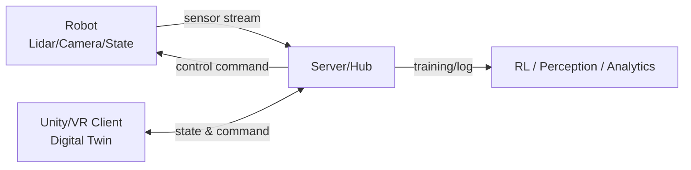

# 한밭대학교 컴퓨터공학과 PhysicalAI팀

**팀 구성**
- 20211930 이대규 (Server/Client-Server 연동 & Interaction, 파트 리더)
- 20222009 진나영 (AI/Perception & Robot Compute, 파트 리더)
- 20211930 조병현 (Unity 디지털 트윈/가상환경, 파트 리더: 주마다 변경)
- 20211908 김현우 (Unity 디지털 트윈/가상환경, 파트 리더: 주마다 변경)
- 20212217 오필승 (Robot Service & UI/UX 이슈, 파트 리더)

## <u>Teamate</u> Project Background
### 1.1 필요성
- **물류 로봇 실험의 한계 극복**: 현재 상용화된 서빙·배송 로봇은 제한된 환경과 고정된 경로를 기반으로 동작하며, 실제 도로(인도, 차도) 주행 실험은 법적 규제와 안전 문제로 인해 수행하기 어렵습니다.
- **유연한 이동 제어 요구**: 수동 조작의 반응 지연과 피로 누적, 단순 반복 작업의 정확도 저하 문제를 해결하기 위해 센서 및 알고리즘 기반의 일관된 이동 품질이 필요합니다.

### 1.2 기존 해결책의 문제점
- **현실적 제약**: 인명 사고 위험 등 돌발 상황에 대한 테스트를 실제 환경에서 진행하기에는 비용과 위험 부담이 큽니다.
- **데이터 동기화의 부재**: 기존 시뮬레이션은 현실과의 괴리(Gap)가 존재하여, 가상 공간의 학습 결과를 실제 로봇에 즉시 적용하거나 실시간으로 동기화하는 데 한계가 있습니다.
  
## System Design
### 2.1 System Architecture
본 프로젝트는 **로봇-서버-게임(유니티/VR) 클라이언트**가 유기적으로 연결된 3단 구조로 설계되었습니다.

1.  **Front-end (Unity 3D/VR)**: 현실 물리가 적용된 디지털 트윈 환경 구축 및 인간 반응 측정
2.  **Back-end (Server & AI)**: 데이터 허브 역할, 강화학습(RL) 기반 경로 최적화 및 제어 명령 하달
3.  **Hardware (RoboMaster S1)**: Lidar/Camera 센싱 데이터 전송 및 서버 명령 구동



### 2.2 System Requirements (핵심 요구사항)
- **심리스(Seamless) 동기화**: 로봇-서버-클라이언트 간 저지연(Low Latency) 데이터 통신을 보장합니다.
지연이나 패킷 손실이 발생할 경우 보간(Interpolation) 및 예측(Prediction)을 통해 끊김 없는 시뮬레이션을 제공합니다.

- **섹션 핸드오프(Section Handoff)**: 복도를 여러 섹션으로 분할하여, 로봇이 진입/이탈 시 해당 구역의 엣지 노드(Raspberry Pi)와 연결/해제하는 분산 제어 방식을 사용합니다.

- **충돌 및 상호작용 처리**: 현실의 돌발 장애물 및 사람과의 충돌을 가상 공간에 즉시 복제하고, 안전 프로토콜(Emergency Stop 등)을 가동합니다.
  
    ## 3. Case Study
- ### Description
  본 시스템은 단순 로봇 제어를 넘어 **디지털 트윈 + 분산 제어 + 인간 중심 설계**를 결합하여 다음과 같은 분야에 적용 가능합니다.

  1. **자율 배송 시스템 (Delivery Robot System)**
     - 로봇이 실시간으로 사람, 장애물, 공간 구조를 인식하고 디지털 트윈 상에서 경로를 재계산합니다.
     - 병원, 학교, 사무실 등 복잡한 실내 환경에서 유연하게 이동합니다.

  2. **이동 보조 시스템 (Mobility Support)**
     - 거동이 불편한 사용자의 이동 속도에 맞춰 동행하거나 목적지까지 안내합니다.
     - 위험 감지 시 자동 정지 또는 우회하여 이동 약자의 자율성을 향상합니다.

  3. **재난 및 위험 지역 탐색**
     - 화재, 붕괴 현장 등 사람이 진입하기 어려운 공간에 로봇을 선행 투입합니다.
     - 디지털 트윈으로 상황을 시각화하여 안전한 진입 경로와 대응 전략을 수립합니다.

  4. **스마트 시티 확장 (Smart City)**
     - 도시 전체를 디지털 트윈으로 구성하고 로봇을 **이동형 센서 노드**로 활용합니다.
     - 도로 및 보행자 밀집도를 분석하여 도시 운영 효율을 극대화합니다.

## 4. Conclusion (결론)
- ### 안전하고 효율적인 실험 환경 제공
  - VR 기반의 상호작용 실험을 통해 현실에서의 사고 위험 없이 다양한 시나리오(도로, 인도, 재난 현장 등)를 검증할 수 있습니다.
- ### 인간-로봇 상호작용(HRI) 최적화
  - 정밀한 이동 제어와 상호작용 데이터를 통해 사람과 공존 가능한 로봇 서비스 모델을 제시합니다.
- ### 미래 확장성 확보
  - 본 프로젝트의 분산 제어 및 동기화 기술은 향후 스마트 시티 및 대규모 물류 자동화 시스템의 기반 기술로 활용될 수 있습니다.

## Project Outcome
- ### 20XX 년 OO학술대회 

# 5. Commit & Pull Request Rule (형상 관리 규칙)

본 프로젝트는 **협업 효율성과 변경 이력 추적성 확보**를 위해  
**Conventional Commit 규칙 + GitHub Pull Request 기반 워크플로우**를 적용한다.

---

## 5.1 Commit Message Convention

커밋 메시지는 다음 형식을 따른다.

```
type(scope): subject
```

### (1) Commit Type 정의

| Type     | 설명                                      |
|----------|-------------------------------------------|
| feat     | 새로운 기능 추가                          |
| fix      | 버그 수정                                 |
| refactor | 기능 변경 없는 코드 구조 개선             |
| docs     | 문서 수정 (README, 설계 문서 등)          |
| style    | 코드 포맷/스타일 수정 (로직 변경 없음)    |
| test     | 테스트 코드 추가 또는 수정                |
| chore    | 빌드, 설정, 의존성 등 기타 작업           |

### (2) Scope 규칙

- 변경 대상 모듈 또는 영역을 명시한다.
- 과도한 세분화는 지양한다.

**Scope 예시**

```
server, ai, unity, robot, network, infra, docs
```

**사용 예**

```
feat(server): 로봇 상태 수집 API 추가
fix(unity): 디지털 트윈 좌표 동기화 오류 수정
refactor(ai): 경로 최적화 로직 모듈 분리
```

### (3) Subject 작성 규칙

- 명령형 사용
- 한글 사용 허용
- 변경 목적이 명확히 드러나도록 작성

**올바른 예**

```
feat(robot): emergency stop 기능 추가
docs(system): 시스템 아키텍처 설명 보완
```

**잘못된 예**

```
수정
버그 고침
일단 커밋
```

---

## 5.2 Commit 단위 원칙

- 하나의 커밋 = 하나의 목적
- 빌드 실패 상태에서 커밋 금지
- 의미 없는 커밋(push용 커밋) 금지

---

## 5.3 Branch Strategy

본 프로젝트는 다음과 같은 브랜치 전략을 따른다.

```
main        : 최종 결과물 / 시연용
develop     : 통합 개발 브랜치
feature/*   : 기능 개발
```

**브랜치 예시**

```
feature/unity-digital-twin
```

---

## 5.4 Pull Request (PR) Rule

- 모든 변경 사항은 **Pull Request(PR)** 를 통해 병합한다.
- `main`, `develop` 브랜치에 **직접 push 금지**
- PR 제목은 커밋 메시지 규칙과 동일하게 작성

**PR 제목 예시**

```
feat(unity): 디지털 트윈 충돌 반영 기능 추가
```

---

## 5.5 형상 관리 원칙 요약

- 명확한 커밋 메시지를 통해 변경 목적을 추적한다.
- PR 기반 협업으로 코드 품질과 안정성을 확보한다.
- 프로젝트 결과물뿐 아니라 개발 과정 자체도 평가 가능한 산출물로 관리한다.

---

